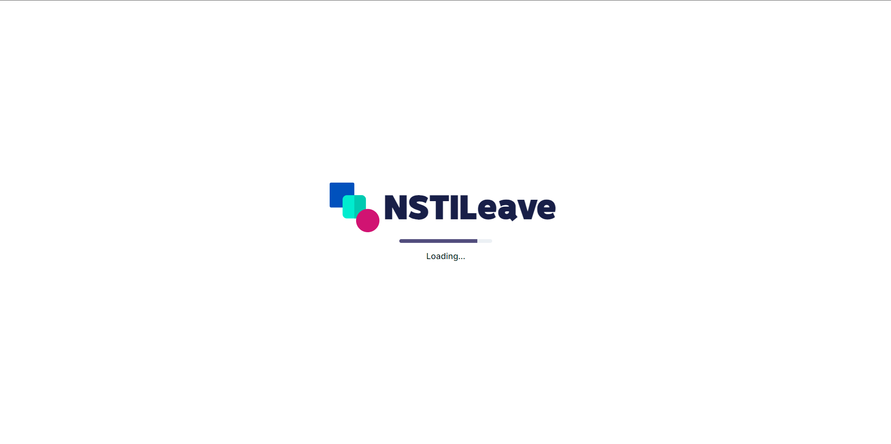

### Note : There are so many thing to change in this project

# NSTI Leave System

The NSTI Leave System is a web-based application developed to streamline the leave management process for staff and students of the National Skill Training Institute (NSTI). 

## Features

- Separate modules for admin, staff, and students
- Admin can manage staff and student details, departments, and leave types
- Staff and students can apply for leave
- Leave applications are routed to the appropriate authority for approval
- Email notifications for leave application status updates

## Installation

1. Clone the repository: git clone [(https://github.com/prem9910/college-leave-system)]
2. Import the database schema: mysql -u [username] -p [nsti_leave] < database/nsti_leave.sql
3. Configure the database connection in config.php file.
4. Start the local server or deploy the project to your web server.

## Usage

1. Navigate to the application URL
2. Log in using appropriate credentials
3. Access relevant modules (admin, staff, student) to perform actions

## Future Enhancements

- Integration with calendar systems for leave scheduling
- Advanced reporting and analytics features
- Mobile application for leave management on-the-go

<!-- ## Contributors

- [Your Name](https://github.com/your-username) -->

## License

This project is licensed under the [MIT License](LICENSE).
